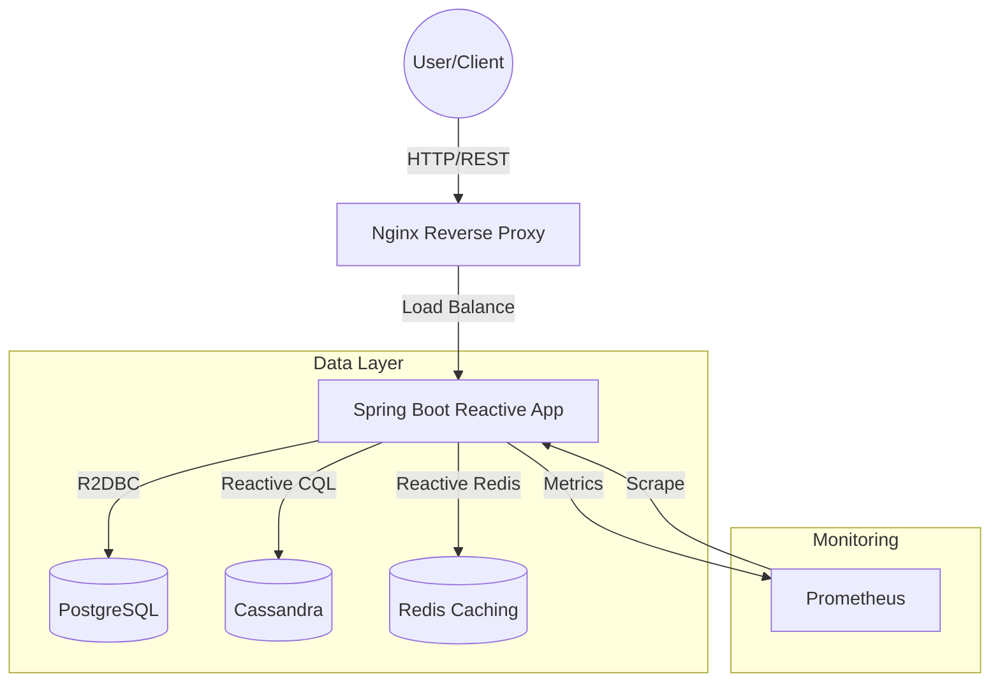

# 📦 Java Reactive Messaging E-commerce API

[](https://spring.io/projects/spring-boot)
[](https://openjdk.org/)
[](https://www.docker.com/)
[](LICENSE)

A high-performance, fully reactive e-commerce backend built with **Spring WebFlux**. This project leverages **R2DBC** for relational data, **Cassandra** for high-volume activity logging, and **Redis** for sub-millisecond caching and messaging.

---

## 🛠 Tech Stack

| Category | Technology |
| :--- | :--- |
| **Core Framework** | Spring Boot 3.2 (WebFlux), Project Reactor |
| **Relational DB** | PostgreSQL 16 (via R2DBC) |
| **NoSQL DB** | Apache Cassandra 4.1 |
| **Caching/Messaging**| Redis 7 |
| **Reverse Proxy** | Nginx (Alpine) |
| **Observability** | Spring Actuator, Prometheus, Micrometer |
| **Documentation** | SpringDoc OpenAPI (Swagger UI) |
| **Testing** | JUnit 5, Reactor Test, Pytest + Playwright |

---

## 🏗 Architecture

The system uses a non-blocking IO model to handle a large number of concurrent connections with minimal resource overhead.



---

## 📂 Project Structure

```text
├── src/
│   ├── main/
│   │   ├── java/com/ecommerce/api/
│   │   │   ├── config/         # Security, Reactive DB configurations
│   │   │   ├── controller/     # REST Endpoints (WebFlux)
│   │   │   ├── dto/            # Data Transfer Objects
│   │   │   ├── exception/      # Global Reactive error handling
│   │   │   ├── mapper/         # MapStruct Mappers
│   │   │   ├── model/          # R2DBC Entities & Cassandra Docs
│   │   │   ├── repository/     # Reactive Repositories
│   │   │   ├── service/        # Business Logic (Reactor)
│   │   │   └── EcommerceApplication.java
│   │   └── resources/
│   │       ├── application.yml
│   │       └── db/migration/   # Flyway SQL Migrations
├── tests/                      # Python E2E Testing Suite
├── compose.yaml                # Full stack orchestration
├── Dockerfile                  # Multi-stage optimized build
├── nginx.conf                  # Proxy & SSL termination config
└── prometheus.yml              # Metrics collection config
```

---

## 🚀 Quick Start

### Prerequisites
- Docker & Docker Compose
- Java 21 (Optional, for local dev)

### Deployment
```bash
# Clone and spin up the entire stack
git clone <repo-url>
cd java-reactive-messaging
docker compose up -d --build
```

The stack includes built-in health checks and will wait for databases to be ready before starting the application.

---

## 📥 API Reference

Once the stack is up, you can access the interactive API documentation:

- **Swagger UI**: `http://localhost/swagger-ui.html`
- **OpenAPI Spec**: `http://localhost/v3/api-docs`

| Method | Endpoint | Description |
| :--- | :--- | :--- |
| `GET` | `/api/v1/products` | Retrieve all products (cached) |
| `POST` | `/api/v1/products` | Create a new product |
| `GET` | `/api/v1/products/{id}`| Get product details & log activity |

---

## 📊 Observability & Monitoring

The application exposes real-time metrics for monitoring health and performance:

- **Actuator Health**: `http://localhost:8080/actuator/health`
- **Prometheus Metrics**: `http://localhost:8080/actuator/prometheus` (Exposed to Prometheus container)
- **Prometheus UI**: `http://localhost:9090`

---

## 🧪 Testing

### Unit & Integration Tests (Java)
```bash
mvn test
```

### End-to-End Tests (Python)
The E2E suite verifies the system through the Nginx proxy layer.
```bash
pip install -r requirements.txt
pytest tests/
```

---

## ☁️ Supported Cloud Providers

This project is container-native and can be deployed to:
- **AWS**: ECS (Fargate), EKS
- **Azure**: Container Apps, AKS
- **GCP**: Cloud Run, GKE
- **DigitalOcean**: App Platform

---

## 🔧 Troubleshooting

> [!IMPORTANT]
> **Cassandra Startup**: Cassandra can take several minutes to initialize. The application is configured with a high retry limit and health-check tolerance to accommodate this.

- **App stays in 'unhealthy' state**: Check logs with `docker compose logs -f app`. It usually means Cassandra is still initializing its metadata.
- **Nginx returns 502/504**: The application is still booting up. Nginx is configured to be resilient and will automatically route traffic once the upstream is ready.
- **Database Connection Refused**: Ensure no other services are using ports `5432`, `9042`, or `6379`.
